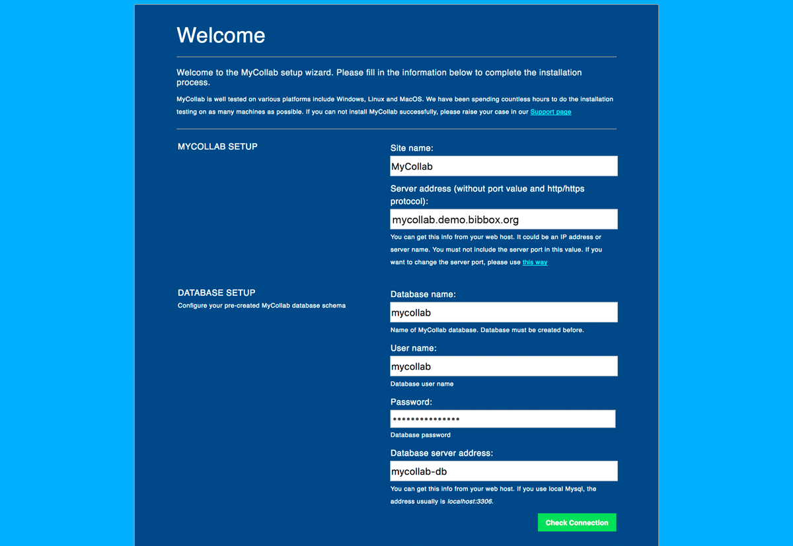
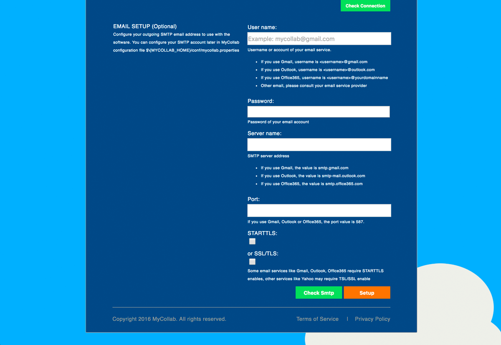
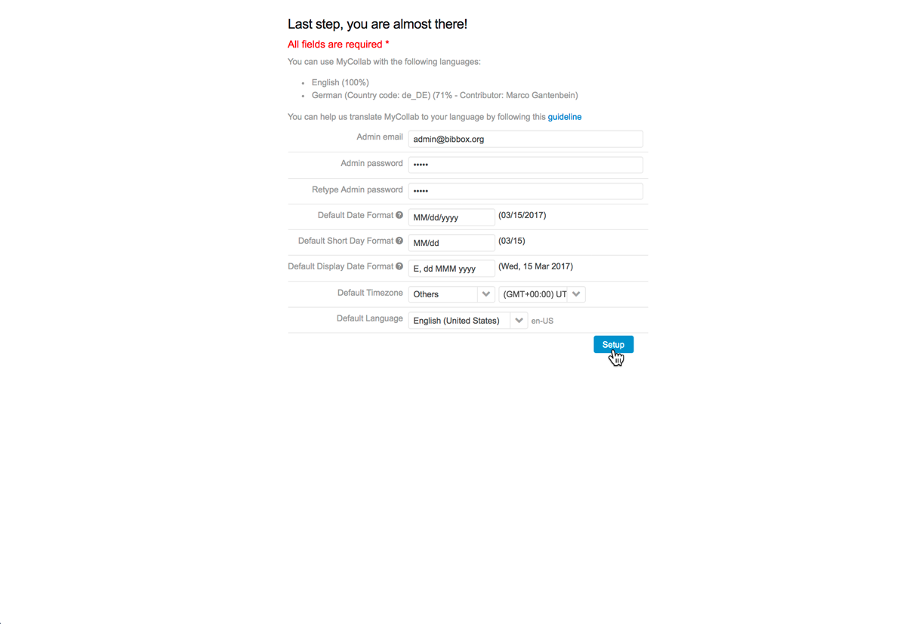
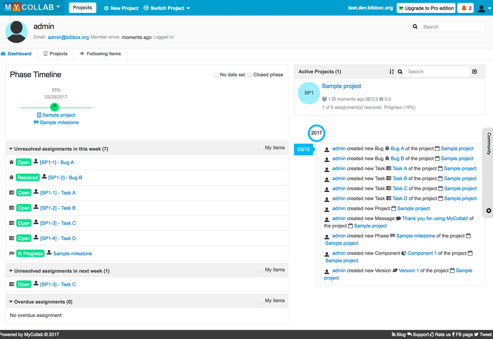

## Quick Notes

Database information is as follows:

```
Database name:              mycollab
User name:                  mycollab
Password:                   mycollab4bibbox
Database server address:    mycollab-db
```


## MyCollab Installation Instructions 

* As soon as MyCollab has been installed within the BIBBOX, you can launch it from the Applications menu.

* A new Tab will open in your browser and show you the welcome page of the setup process. Since this BIBBOX application already comes with an up and running MySQL database, all you need to do is enter the database information, **Site name** and **Server address** (please enter the URL to your MyCollab app here, e.g. **mycollab.demo.bibbox.org**) into the corresponding fields. You can then test your connection with the green **Check Connection** button.

        Database name:              mycollab
        User name:                  mycollab
        Password:                   mycollab4bibbox
        Database server address:    mycollab-db
        


* For basic usage and some testing, this is already enough, but if you want to use this tool in production, you will need to connect an mail server to it. You can enter your mail server configuration in the lower half of the same setup page and again check your connection with the green **Check setup** button. When everything is working, just finish the setup process by clicking the orange **Setup** button.



* MyCollab will take some time setting up the database in the background and will then redirect you to one more form. This time, you can enter your administration information like **Admin email**, **Admin password** and some date, timezone and language settings. After you have entered your information, click the blue **Setup** button.



* That's it! You have successfully installed MyCollab in your BIBBOX and are ready for managing your projects with it!




## After the installation

Have a nice ride with the new Admins youngtimer.

